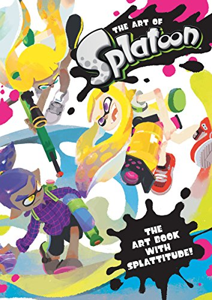
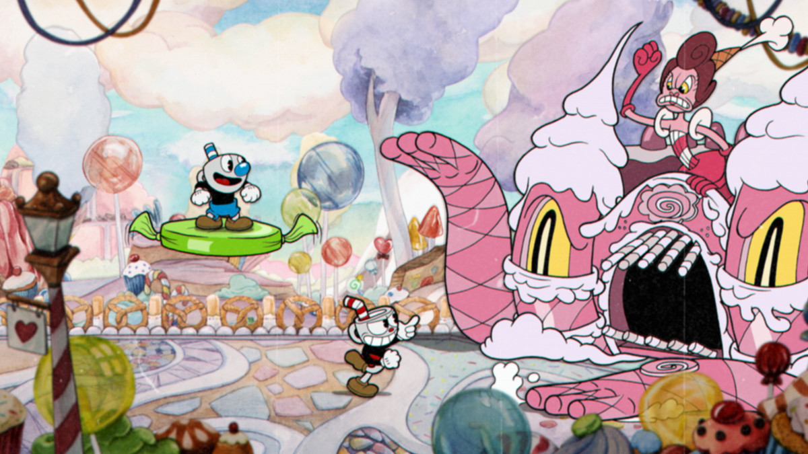
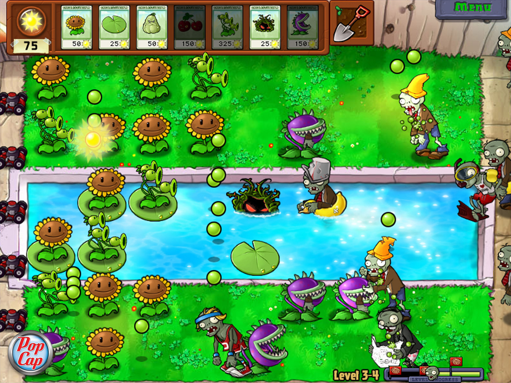
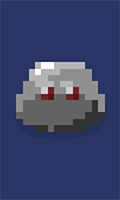
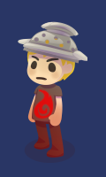
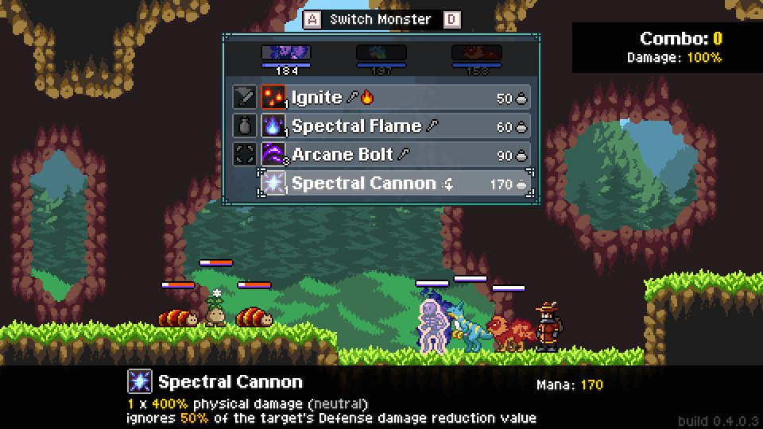

# ART BIBLE DOCUMENT

***

## Main Index

+ [Mood](ArtBible.md#mood)
  - [Art Style](ArtBible.md#art-style)
  - [Character Art](ArtBible.md#character-art)
  - [Level of Detail](ArtBible.md#level-of-detail)
  - [Camera](ArtBible.md#camera)
  - [Scale](ArtBible.md#scale)
  - [Scenarios](ArtBible.md#scenarios)
  - [Color Palette](ArtBible.md#color-palette): Visual Hierarchy
  - [Atmosphere](ArtBible.md#atmosphere)
  - [UI](ArtBible.md#ui): Main Menu - In Game - Font
  - [References](ArtBible.md#references)

+ [Intention of the Graphics](https://github.com/Needlesslord/BrainDeadStudios/blob/master/Docs/ArtBible.md#intention-of-the-graphics)

+ [Art Used](https://github.com/Needlesslord/BrainDeadStudios/blob/master/Docs/ArtBible.md#art-used)

+ [Concept Art](https://github.com/Needlesslord/BrainDeadStudios/blob/master/Docs/ArtBible.md#concept-art)

+ [Technical Guidelines](https://github.com/Needlesslord/BrainDeadStudios/blob/master/Docs/ArtBible.md#technical-guidelines)

+ [Credits](https://github.com/Needlesslord/BrainDeadStudios/blob/master/Docs/ArtBible.md#credits)

***

## Mood

The mood of the game will be irreverent, cutesy, carefree and laid back. However, it will also present a foreign factor to it with a more "post-urbanistic" appeal to the environment. Both the paint gimmick and art inspiration are taken from Nintendo's Splatoon, without taking the more urban and contemporary parts.

### Art Style

The Art Style we're going for is Cartoon, as in simplistic, colourful and irreverent. The main focus in the art department is to make the game feel like a fun and relaxing experience. This choice also makes it easier for the team to adapt open art so that it fits the story more easily.

These are some examples of games with similar styles:

### Character Art

The different playable troops will have similar designs, with the only change being clothing and weapon. These designs will be colourful and simple, as dictated by the art style.

For the different foes faced, however, sprites will be monochromatic and stay within the grey scale except for one feature in their design that will keep the "original" color, to set the enemies apart.

### Level of Detail

Since the resources are scarce and the art style has been chosen accordingly, the level of detail / complexity of the art will be pretty low. Not a great amount of time should be inverted in the art department since it will not be evaluated. We should also take into account the fact that the game will mostly use open art, either as downloaded or edited.

Knowing this, all assets should only aim to cover these points:
+ Appealing
+ Coherent with the Narrative and Gameplay
  + Paint-Related
  + Fills its in-game purpose
+ Coherent with the rest of the Art
  + No hard lines
  + Minimalistic Design
  + Isometric
  
An example of homogeneous and effective but low-detail game art:

  
  
### Camera

The Camera will be located above the game map, placing it in an isometric perspective. There will be free traslation of the camera but no rotation, since the game is 2D. Unexplored terrain, though, will be covered by the Fog of War. An example of a game with a similar Camera would be They are Billions.

### Scale

### Scenarios

### Color Palette

#### Visual Hierarchy

### Atmosphere

### UI

#### Main Menu

#### In Game

#### Font

### References

***

## Intention of the Graphics

***

## Art Used

***

## Concept Art

***

## Technical Guidelines

***

## Credits

***

